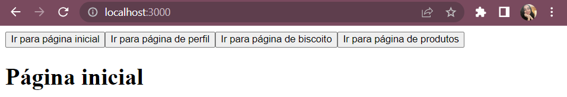
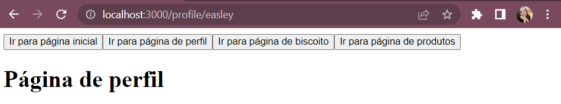
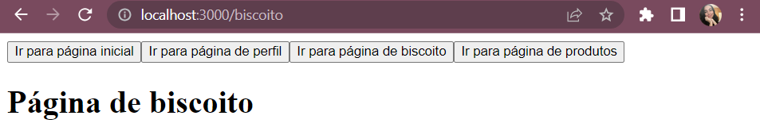

# React Router - Exercício

## Índice

-   [1. Configurações Iniciais](#1-configurações-iniciais)
-   [2. Exercício 1](#2-exercício-1)
-   [3. Exercício 2](#3-exercício-2)
-   [4. Extra](#4-extra)
-   [5. Exercício 3](#5-exercício-3)
-   [6. Resultado Final](#6-resultado-final)

## 1. Configurações Iniciais

-   Na raíz do projeto `src`, instalei o React Router:

    ```
    npm install react-router-dom
    ```

## 2 Exercício 1

### Enunciado

Crie um site com roteamento de 3 páginas, utilizando o React Router:

-   Página inicial
-   Página de perfil
-   Página de erro

### Resolução

-   Dentro da pasta `src` criei uma pasta `routes` e dentro de `routes` criei um arquivo chamado `Router.js`, nesse arquivo criei as rotas com os componentes importados: `<BrowserRouter></BrowserRouter>`, `<Routes></Routes>` e <Route/>. Cada `Route` recebe um `path` e um `element` que corresponde à qual página será escolhida para ser exibida diante do path apresentado.

    -   Código de `Router.js`:

        ```
        import React from 'react';
        import { BrowserRouter, Route, Routes } from 'react-router-dom';
        import HomePage from '../pages/HomePage';
        import ProfilePage from '../pages/ProfilePage';
        import ErrorPage from '../pages/ErrorPage';

        const Router = () => {
            return (
                <BrowserRouter>
                    <Routes>
                        <Route path="/" element={<HomePage />} />
                        <Route path="/profile/:name" element={<ProfilePage />} />
                        <Route path="*" element={<ErrorPage />} />
                    </Routes>
                </BrowserRouter>
            );
        };

        export default Router;

        ```

-   Além disso, é preciso chamar o arquivo `Router,js` em `App.js` para que ele possa ser renderizado conforme solicitado. Lembrando que até esse momento mudamos a url manualmente para ver a mudança de rotas acontecendo.

    -   Código de `App.js`:

        ```
        import Router from './routes/Router';

        function App() {
            return (
                <>
                    Exercicio de Router
                    <Router />
                </>
            );
        }

        export default App;
        ```

## 3 Exercício 2

### Enunciado

Agora monte a mudança de rota no clique dos botões do cabeçalho:

-   Botão de ir para página inicial
-   Botão de ir para página de perfil

### Resolução

-   Em `src` criei uma pasta chamada `Components` com um arquivo `Header.js`. Em `Header.js` criei os botões para a troca de rotas;
-   Dentro de `routes` criei um arquivo chamado `coordinator.js`, dentro desse arquivo estão as funções responsáveis pelas mudanças de rotas;
-   Dentro das funções de `routes`, cada função precisa receber como **primeiro parâmetro** uma outra função, e esta outra função recebe um `path`, esse `path` é o caminho para o qual a função vai me levar;
-   Quando `Header.js` importar as funções de `coordinator.js`, ele irá passar como argumento o hook `useNavigate`;
-   O `useNavigate` serve para realizar a navegação, sem a necessidade de mudança manual no link da página, pois dentro dele é contido um `path` que mostra esse caminho;
-   Um observação importante é que o `useNavigate` só pode ser invocado **dentro de um componente**, por isso ele é invocado em `Header.js` e passado como **primeiro** argumento das funções importadas de `Header.js`;
-   Resumindo o fluxo da lógica:
    -   `Header.js` é chamado nas páginas onde desejo ter os botões para a troca de rotas, nesse casso em:
        -   `HomePage.js`;
        -   `ProfilePage.js`;
    -   `coordinator.js` exporta as funções de mudanças de rotas;
    -   `Header.js` importa as funções de `coordinator.js` usando-as no `OnClick` dos botões, passando como argumento de suas funções o hook `useNavigate`;
-   Dessa forma temos os seguintes códigos:

    -   `coordinator.js`:

        ```
        export const goToHome = (navegate) => {
            navegate('/');
        };

        export const goToProfile = (navegate, name) => {
            navegate(`/profile/${name}`);
        };
        ```

    -   `Header.js`:

        ```
        import { useNavigate } from 'react-router-dom';
        import { goToHome, goToProfile } from '../routes/coordinator';

        function Header() {
            const navegate = useNavigate();

            return (
                <div>
                    <button
                        onClick={() => {
                            goToHome(navegate);
                        }}
                    >
                        Ir para página inicial
                    </button>
                    <button
                        onClick={() => {
                            goToProfile(navegate, 'easley');
                        }}
                    >
                        Ir para página de perfil
                    </button>
                </div>
            );
        }

        export default Header;

        ```

    -   `HomePage.js`:

        ```
        import Header from "../Components/Header";

        function HomePage() {
            return (
                <section>
                    <h1>Página inicial</h1>
                    <Header/>
                </section>
            );
        }

        export default HomePage;
        ```

    -   `ProfilePage.js`:

        ```
        import Header from '../Components/Header';

        function ProfilePage() {
            return (
                <section>
                    <h1>Página de perfil</h1>
                    <Header />
                </section>
            );
        }

        export default ProfilePage;

        ```

## 4 Extra

### Enunciado

Isso não faz parte do exercício apenas quis criar uma página chamada biscoito para revisar os passos anteriores

### Resolução

1. Dentro de `pages` criei um arquivo chamado `BiscoitoPage.js` com o seguinte código:

    ```
    import React from 'react';
    import Header from '../Components/Header';

    const BiscoitoPage = () => {
        return (
            <>
                <Header />
                <h1>Página de biscoito</h1>
            </>
        );
    };

    export default BiscoitoPage;
    ```

2. Em `Router.js`, acrescente mais um componente `Route` para essa rota, e importei o componente para usar em `element`:

    ```
    (..)
    import BiscoitoPage from '../pages/BiscoitoPage';
    (..)
    <Route path="/biscoito" element={<BiscoitoPage />} />
    (..)
    ```

3. Testei mudando o link manualmente:

    ```
    http://localhost:3000/biscoito
    ```

4. Acrescentei a função de mudar para essa rota no arquivo `coordinator.js`:
    ```
    export const goToBiscoito = (navegate) => {
        navegate('/biscoito');
    };
    ```
5. Importei a função em `Header.js`, criei um botão para ela e chamei a função importada no Onclick do novo botão:

    ```
    (...)
    import { goToBiscoito, goToHome, goToProfile } from '../routes/coordinator';
    (...)
    <button
        onClick={() => {
            goToBiscoito(navegate);
        }}
    >
        Ir para página de biscoito
    </button>
    (...)
    ```

6. Chamei o `Header.js` dentro da página `BiscoitoPage.js`:

    ```
    import React from 'react';
    import Header from '../Components/Header';

    const BiscoitoPage = () => {
        return (
            <>
                <Header />
                <h1>Página de Biscoito</h1>
            </>
        );
    };

    export default BiscoitoPage;
    ```

## 5 Exercício 3

### Enunciado

Agora configure uma rota que utiliza path param:

Crie uma nova página de produto específico por id **“/product/:id”**

**Não se preocupe em aplicar navegação de rota nela**

### Resolução

1. Dentro de `pages` criei um arquivo chamado `ProductsPage.js` com o seguinte código:

    ```
    import React from 'react';
    import Header from '../Components/Header';

    const ProductsPage = () => {
        return (
            <>
                <Header />
                <h1>Página de produtos</h1>
            </>
        );
    };

    export default ProductsPage;

    ```

2. Em `Router.js`, acrescente mais um componente `Route` para essa rota, e importei o componente para usar em `element`:

    ```
    (..)
    import ProductsPage from '../pages/ProductsPage';
    (..)
    <Route path="/product/:id" element={<ProductsPage />} />
    (..)
    ```

3. Testei mudando o link manualmente:

    ```
    http://localhost:3000/product/:id
    ```

4. Acrescentei a função de mudar para essa rota no arquivo `coordinator.js`:
    ```
    export const goToProducts = (navegate, id) => {
        navegate(`/product/${id}`);
    };
    ```
5. Importei a função em `Header.js`, criei um botão para ela e chamei a função importada no Onclick do novo botão:

    ```
    (...)
    import { goToBiscoito, goToHome, goToProducts, goToProfile } from '../routes/coordinator';
    (...)
    <button
        onClick={() => {
            goToProducts(navegate, 123);
        }}
    >
        Ir para página de produtos
    </button>
    (...)
    ```

## 6 Resultado final

-   Clicando em _página inicial_:
    

-   Clicando em _página de perfil_:
    

-   Clicando em _página de bicoito_:
    

-   Clicando em _página de produtos_:
    
